# 书海阁项目综合测试用例设计（JUnit实现版）

## 一、图书管理模块测试(范仕洲)

### 1. 白盒测试

本节对BookServiceImpl类中的方法进行白盒测试设计，包括选择结构测试和循环结构测试两部分。

#### 1.1 选择结构测试

选择结构测试针对具有多个条件判断和分支的代码，测试不同条件组合下的程序行为。

##### 1.1.1 测试代码 - getBookDetail方法

```java
@Override
public Book getBookDetail(Long id) {
    // 添加输入验证和边界条件
    if (id == null || id <= 0) {
        return null;
    }
    
    Book book = getById(id);
    
    // 对图书信息进行后处理（适合测试）
    if (book != null) {
        // 确保作者字段不为空（数据规范化）
        if (book.getAuthor() == null || book.getAuthor().isEmpty()) {
            book.setAuthor("未知作者");
        }
    }
    
    return book;
}
```

##### 1.1.2 方法流程图

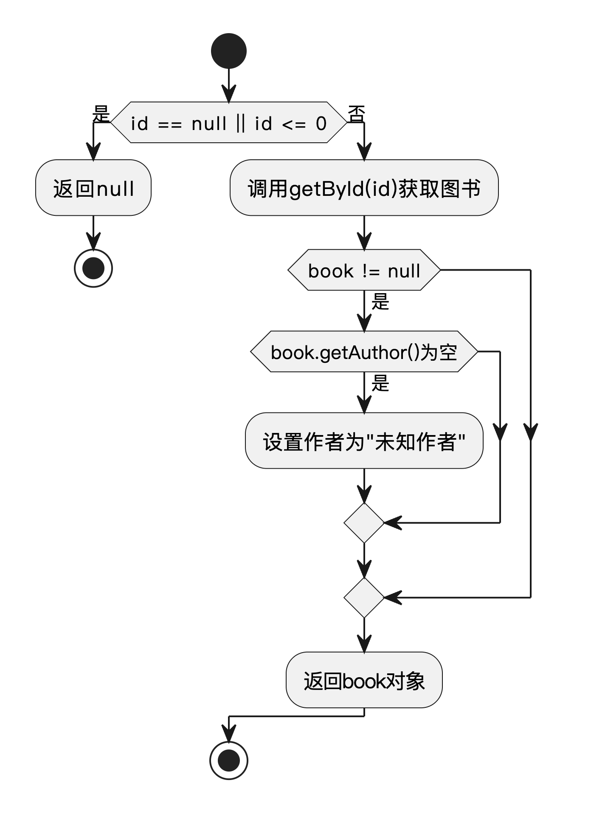

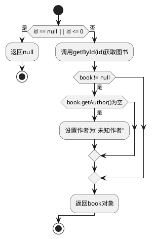

##### 1.1.3 语句覆盖测试

语句覆盖确保程序中的每条语句至少执行一次，是最基本的覆盖标准。

| 测试用例ID | 测试场景 | 测试输入 | 预期结果 | 覆盖语句 |
| --- | --- | --- | --- | --- |
| TCB-SC01 | 参数无效 | id=null | 返回null | 2-4行 |
| TCB-SC02 | 图书不存在 | id=99999 | 返回null | 2-6, 16行 |
| TCB-SC03 | 作者需规范化 | id=1, book.author=null | 返回规范化后的图书 | 2-6, 9-13, 16行 |
| TCB-SC04 | 无需规范化 | id=1, 作者正常 | 返回原图书不变 | 2-6, 9, 16行 |

##### 1.1.4 判定覆盖测试

判定覆盖测试关注代码中每个判定结构的取值情况，确保每个判定的每个可能结果至少发生一次。

| 测试用例ID | 判定 | 判定结果 | 测试输入 | 预期结果 |
| --- | --- | --- | --- | --- |
| TCB-DC01 | id == null \|\| id <= 0 | true | id=null | 返回null |
| TCB-DC02 | id == null \|\| id <= 0 | false | id=1 | 继续执行 |
| TCB-DC03 | book != null | true | id=1, 存在图书 | 进行数据规范化 |
| TCB-DC04 | book != null | false | id=99999, 不存在图书 | 返回null |
| TCB-DC05 | book.getAuthor() == null \|\| book.getAuthor().isEmpty() | true | 作者为null | 设置为"未知作者" |
| TCB-DC06 | book.getAuthor() == null \|\| book.getAuthor().isEmpty() | false | 作者为"张三" | 不修改作者 |

##### 1.1.5 条件覆盖测试

条件覆盖关注复合判定中的各个简单条件，确保每个简单条件都有机会取到真值和假值。

| 测试用例ID | 条件 | 条件取值 | 测试输入 | 预期结果 |
| --- | --- | --- | --- | --- |
| TCB-CC01 | id == null | true | id=null | 返回null |
| TCB-CC02 | id == null | false | id=-1 | 返回null |
| TCB-CC03 | id <= 0 | true | id=-1 | 返回null |
| TCB-CC04 | id <= 0 | false | id=1 | 继续执行 |
| TCB-CC05 | book.getAuthor() == null | true | 作者=null | 设置为"未知作者" |
| TCB-CC06 | book.getAuthor().isEmpty() | true | 作者="" | 设置为"未知作者" |

##### 1.1.6 判定/条件覆盖与条件组合覆盖测试

这部分测试综合了判定覆盖、条件覆盖和条件组合覆盖，探测复合条件中各个子条件组合的不同情况。

| 测试用例ID | 判定与条件组合 | 测试输入 | 预期结果 |
| --- | --- | --- | --- |
| TCB-MCC01 | id: (null, -)，无法评估第二个条件 | id=null | 返回null |
| TCB-MCC02 | id: (非null, <=0)，第二个条件为真 | id=-1 | 返回null |
| TCB-MCC03 | id: (非null, >0)，两个条件都为假 | id=1 | 继续执行 |
| TCB-MCC04 | author: (null, -)，无法评估第二个条件 | 作者=null | 设置为"未知作者" |
| TCB-MCC05 | author: (非null, 空字符串)，第二个条件为真 | 作者="" | 设置为"未知作者" |
| TCB-MCC06 | author: (非null, 非空)，两个条件都为假 | 作者="张三" | 不修改 |

##### 1.1.7 路径覆盖测试

路径测试关注程序中的执行路径，确保主要的执行分支都能被测试到。

| 测试用例ID | 主要路径 | 测试输入 | 预期结果 |
| --- | --- | --- | --- |
| TCB-PC01 | id参数验证失败路径 | id=null 或 id=-1 | 返回null |
| TCB-PC02 | 图书查询失败路径 | id=99999 | 返回null |
| TCB-PC03 | 作者需规范化路径 | id=1, 作者=null | 返回规范化的图书 |
| TCB-PC04 | 图书正常无需规范化路径 | id=1, 作者正常 | 返回原图书不变 |

#### 1.2 循环结构测试

循环结构测试关注程序中的循环语句，测试不同循环次数和循环体内执行路径的情况。

##### 1.2.1 测试代码 - listAllBooks方法循环部分

```java
// 循环结构 - 遍历所有图书
List<Book> filteredBooks = new ArrayList<>();
for (Book book : allBooks) {
    // 初始化匹配标志
    boolean nameMatch = false;
    boolean authorMatch = false; 
    boolean categoryMatch = false;
    
    // 检查各字段是否匹配 (省略内部判断代码)
    
    // 满足条件则添加到结果集
    if (nameMatch || authorMatch || categoryMatch) {
        filteredBooks.add(book);
    }
}
```

##### 1.2.2 循环流程图

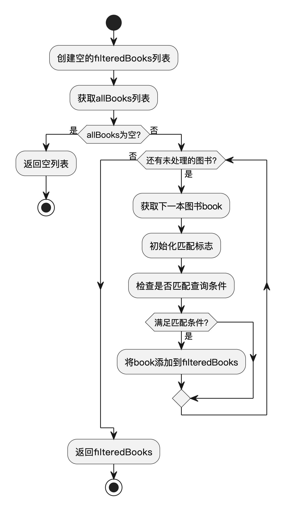

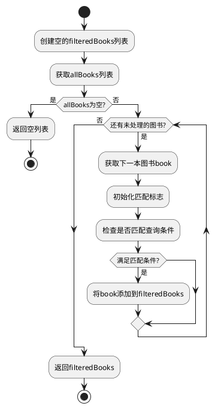

##### 1.2.3 循环结构测试用例

下面设计一系列测试用例，针对循环结构的不同情况进行测试：

| 测试用例ID | 测试场景 | 测试输入 | 预期结果 |
| --- | --- | --- | --- |
| TCB-LT01 | 无数据循环 | 空的图书列表，任意查询词 | 返回空列表 |
| TCB-LT02 | 单次循环 | 包含1本图书的列表，匹配的查询词 | 返回包含该图书的列表 |
| TCB-LT03 | 多次循环-部分匹配 | 包含多本图书的列表，只匹配部分图书的查询词 | 返回匹配的图书列表 |
| TCB-LT04 | 多次循环-全部匹配 | 包含多本图书的列表，匹配所有图书的查询词 | 返回所有图书的列表 |
| TCB-LT05 | 多次循环-无匹配 | 包含多本图书的列表，不匹配任何图书的查询词 | 返回空列表 |
| TCB-LT06 | 大数据量循环 | 接近系统处理上限的图书列表 | 正确返回匹配的图书列表，无性能问题 |
| TCB-LT07 | 特殊数据处理 | 包含部分字段为null的图书 | 正确处理空值不抛出异常 |

### 2. 黑盒测试（等价类划分法）

#### 1.1 测试对象描述

"添加图书"功能要求用户填写图书的标题、作者、分类、价格和描述。系统对这些输入有如下校验规则：标题为必填项，长度必须在1到50个字符之间；作者为必填项，长度必须在1到30个字符之间；分类为必填项，长度必须在1到20个字符之间；价格为必填项，必须为0.01到9999.99之间的数值；描述为可选项，长度不能超过200个字符。如果输入不满足上述任一条件，系统应给出相应的错误提示并拒绝添加。

#### 1.2 等价类划分

| 条件描述                     | 有效等价类（编号Ex）         | 无效等价类（编号Ix）         |
|------------------------------|-----------------------------|-----------------------------|
| 标题长度为1-50个字符         | E1: 标题长度1-50            | I1: 标题为空<br>I2: 标题超50字符 |
| 作者长度为1-30个字符         | E2: 作者长度1-30            | I3: 作者为空<br>I4: 作者超30字符 |
| 分类长度为1-20个字符         | E3: 分类长度1-20            | I5: 分类为空<br>I6: 分类超20字符 |
| 价格为0.01-9999.99           | E4: 价格0.01-9999.99        | I7: 价格小于0.01<br>I8: 价格大于9999.99 |
| 描述长度为0-200个字符        | E5: 描述长度0-200           | I9: 描述超200字符            |

#### 1.3 测试用例设计

| 测试用例ID | 测试用例名称         | 测试输入                                                         | 预期结果                   | 覆盖等价类         |
| ---------- | -------------------- | ---------------------------------------------------------------- | -------------------------- | ------------------ |
| TC-B01     | 标准有效输入         | 标题: "Java编程"<br>作者: "张三"<br>分类: "编程"<br>价格: 88.5<br>描述: "入门教程" | 添加成功                   | E1,E2,E3,E4,E5     |
| TC-B02     | 标题为空             | 标题: ""<br>作者: "张三"<br>分类: "编程"<br>价格: 88.5      | 添加失败，提示标题不能为空 | I1                 |
| TC-B03     | 标题超长             | 标题: 51字符<br>作者: "张三"<br>分类: "编程"<br>价格: 88.5    | 添加失败，提示标题过长     | I2                 |
| TC-B04     | 作者超长             | 标题: "Java"<br>作者: 31字符<br>分类: "编程"<br>价格: 88.5    | 添加失败，提示作者过长     | I4                 |
| TC-B05     | 分类为空             | 标题: "Java"<br>作者: "张三"<br>分类: ""<br>价格: 88.5      | 添加失败，提示分类不能为空 | I5                 |
| TC-B06     | 价格为0              | 标题: "Java"<br>作者: "张三"<br>分类: "编程"<br>价格: 0     | 添加失败，提示价格无效     | I7                 |
| TC-B07     | 价格超上限           | 标题: "Java"<br>作者: "张三"<br>分类: "编程"<br>价格: 10000 | 添加失败，提示价格无效     | I8                 |
| TC-B08     | 标题边界（1字符）    | 标题: "J"<br>作者: "张三"<br>分类: "编程"<br>价格: 88.5     | 添加成功                   | E1                 |
| TC-B09     | 价格边界（0.01）     | 标题: "Java"<br>作者: "张三"<br>分类: "编程"<br>价格: 0.01  | 添加成功                   | E4                 |
| TC-B10     | 描述超长             | 标题: "Java"<br>作者: "张三"<br>分类: "编程"<br>价格: 88.5<br>描述: 201字符 | 添加失败，提示描述过长     | I9                 |

## 二、图书搜索模块测试(管海峰)

### 1. 白盒测试

本节对BookServiceImpl类中的图书搜索相关方法进行白盒测试设计，同样包括选择结构测试和循环结构测试。

#### 1.1 选择结构测试

选择结构测试针对具有多个条件判断和分支的代码，测试不同条件组合下的程序行为。

##### 1.1.1 测试代码 - decrementFavoriteCount方法

```java
/**
 * 减少图书收藏数
 */
public boolean decrementFavoriteCount(Long bookId) {
    // 参数验证
    if (bookId == null || bookId <= 0) {
        return false;
    }
    
    // 获取图书
    Book book = getById(bookId);
    if (book == null) {
        return false;
    }
    
    // 处理收藏数
    Integer favoriteCount = book.getFavoriteCount();
    
    if (favoriteCount == null) {
        // 如果收藏数为null，设置为0
        book.setFavoriteCount(0);
        return true;
    } else if (favoriteCount > 0) {
        // 正常减少收藏数
        book.setFavoriteCount(favoriteCount - 1);
        return true;
    } else {
        // 收藏数已经是0，不做变更
        return true;
    }
}
```

##### 1.1.2 方法流程图

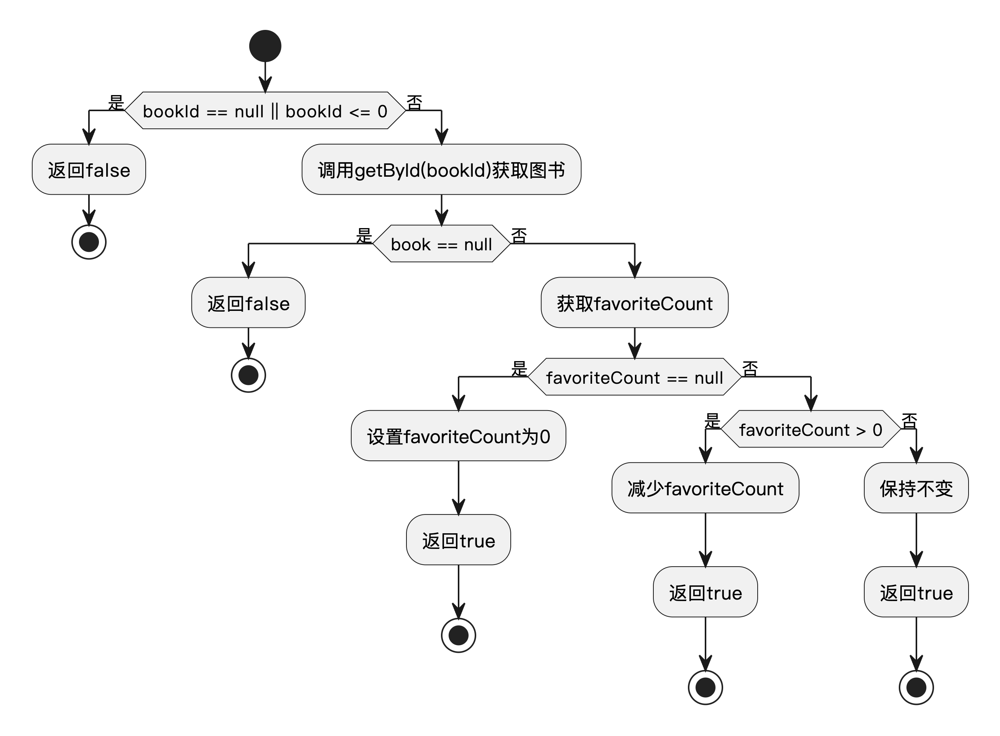

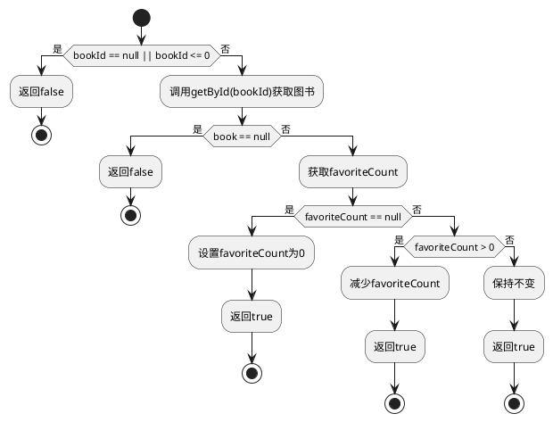

##### 1.1.3 语句覆盖测试

该方法的语句覆盖测试需要覆盖各种参数条件和分支，确保每个语句都被执行到。

| 测试用例ID | 测试场景 | 测试输入 | 预期结果 | 覆盖语句 |
| --- | --- | --- | --- | --- |
| TCS-SC01 | 参数无效 | bookId=null | 返回false | 3-5行 |
| TCS-SC02 | 图书不存在 | bookId=99999 | 返回false | 3-5, 8-11行 |
| TCS-SC03 | 收藏数为null | bookId=1, 图书存在, favoriteCount=null | 设置为0并返回true | 3-5, 8-17行 |
| TCS-SC04 | 收藏数大于0 | bookId=1, 图书存在, favoriteCount=5 | 减1并返回true | 3-5, 8-14, 18-21行 |
| TCS-SC05 | 收藏数为0 | bookId=1, 图书存在, favoriteCount=0 | 不变并返回true | 3-5, 8-14, 18, 22-25行 |

##### 1.1.4 判定覆盖测试

对每个判定结构的不同取值情况进行测试，确保所有可能的判定结果都被测试。

| 测试用例ID | 判定 | 判定结果 | 测试输入 | 预期结果 |
| --- | --- | --- | --- | --- |
| TCS-DC01 | bookId == null \|\| bookId <= 0 | true | bookId=null | 返回false |
| TCS-DC02 | bookId == null \|\| bookId <= 0 | false | bookId=1 | 继续执行 |
| TCS-DC03 | book == null | true | bookId=99999, 图书不存在 | 返回false |
| TCS-DC04 | book == null | false | bookId=1, 图书存在 | 继续执行 |
| TCS-DC05 | favoriteCount == null | true | favoriteCount=null | 设置为0并返回true |
| TCS-DC06 | favoriteCount == null | false | favoriteCount=5 | 继续执行 |
| TCS-DC07 | favoriteCount > 0 | true | favoriteCount=5 | 减1并返回true |
| TCS-DC08 | favoriteCount > 0 | false | favoriteCount=0 | 不变并返回true |

##### 1.1.5 条件覆盖测试

测试复合判定中各个简单条件的不同取值，确保每个条件都有机会被单独评估。

| 测试用例ID | 条件 | 条件取值 | 测试输入 | 预期结果 |
| --- | --- | --- | --- | --- |
| TCS-CC01 | bookId == null | true | bookId=null | 返回false |
| TCS-CC02 | bookId == null | false | bookId=-1 | 返回false |
| TCS-CC03 | bookId <= 0 | true | bookId=-1 | 返回false |
| TCS-CC04 | bookId <= 0 | false | bookId=1 | 继续执行 |

##### 1.1.6 判定/条件覆盖与条件组合覆盖测试

结合测试判定的整体结果和各条件的组合情况，实现更全面的测试覆盖。

| 测试用例ID | 判定与条件组合 | 测试输入 | 预期结果 |
| --- | --- | --- | --- |
| TCS-MCC01 | bookId: (null, -)，第一个条件为真时短路 | bookId=null | 返回false |
| TCS-MCC02 | bookId: (非null, <=0)，第二个条件为真 | bookId=-1 | 返回false |
| TCS-MCC03 | bookId: (非null, >0)，两个条件都为假 | bookId=1 | 继续执行 |

##### 1.1.7 路径覆盖测试

系统地测试程序中所有可能的执行路径，确保每条路径都被覆盖到。

| 测试用例ID | 主要路径 | 测试输入 | 预期结果 |
| --- | --- | --- | --- |
| TCS-PC01 | 参数验证失败路径 | bookId=null 或 bookId=-1 | 返回false |
| TCS-PC02 | 图书不存在路径 | bookId=99999 | 返回false |
| TCS-PC03 | 收藏数为null初始化路径 | bookId=1, favoriteCount=null | 设置为0并返回true |
| TCS-PC04 | 收藏数正常减少路径 | bookId=1, favoriteCount=5 | 减1并返回true |
| TCS-PC05 | 收藏数已为0路径 | bookId=1, favoriteCount=0 | 不变并返回true |

#### 1.2 循环结构测试

循环结构测试关注程序中的循环语句，测试不同循环次数和循环体内执行路径的情况。

##### 1.2.1 测试代码 - listAllBooksAndSortByFavoriteCount方法循环部分

```java
/**
 * 获取按收藏量排序的图书
 */
public List<Book> listAllBooksAndSortByFavoriteCount(String query, String sortType) {
    // 获取所有图书
    List<Book> allBooks = list();
    List<Book> result = new ArrayList<>();
    
    // 手动循环实现过滤
    for (Book book : allBooks) {
        // 无查询条件或者书名/作者匹配时添加到结果集
        if (!StringUtils.hasText(query) || 
            (book.getName() != null && book.getName().toLowerCase().contains(query.toLowerCase())) || 
            (book.getAuthor() != null && book.getAuthor().toLowerCase().contains(query.toLowerCase()))) {
            
            result.add(book);
        }
    }
    
    // 注：此处省略排序逻辑
    // 根据sortType参数对result列表进行按收藏量排序
    
    return result;
}
```

##### 1.2.2 循环流程图

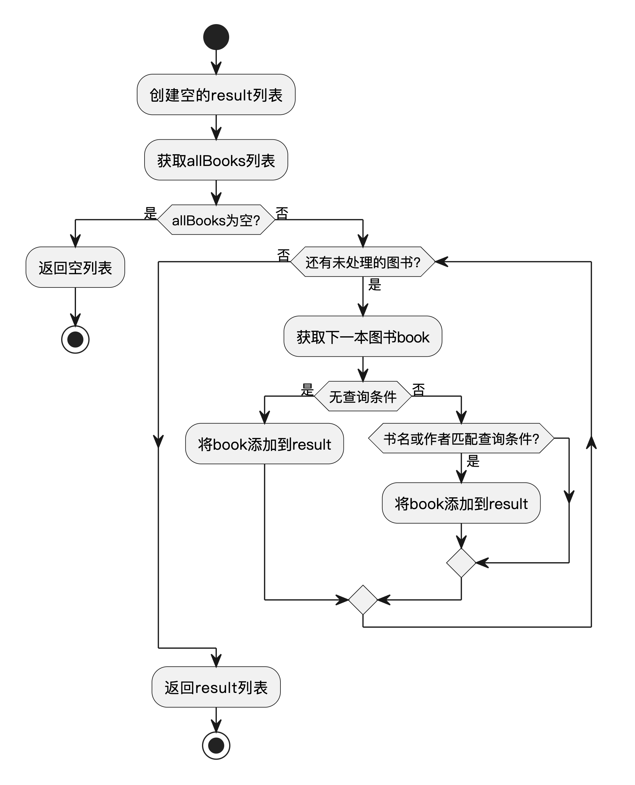

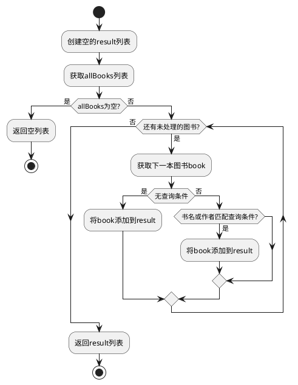

##### 1.2.3 循环结构测试用例

针对循环结构设计的测试用例，着重测试不同数据量和匹配条件下的系统行为：

| 测试用例ID | 测试场景 | 测试输入 | 预期结果 |
| --- | --- | --- | --- |
| TCS-LT01 | 空列表测试 | 空的图书列表，任意查询词 | 返回空列表 |
| TCS-LT02 | 单元素测试 | 包含1本图书的列表，匹配的查询词 | 返回包含该图书的列表 |
| TCS-LT03 | 全部匹配测试 | 包含多本图书的列表，无查询条件 | 返回所有图书的列表 |
| TCS-LT04 | 部分匹配测试 | 包含多本图书的列表，匹配部分图书的查询词 | 返回匹配的图书列表 |
| TCS-LT05 | 无匹配测试 | 包含多本图书的列表，不匹配任何图书的查询词 | 返回空列表 |
| TCS-LT06 | null值处理测试 | 包含书名或作者为null的图书 | 正确处理空值不抛出异常 |

### 2. 黑盒测试（等价类划分法）

#### 2.1 测试对象描述

"图书搜索"功能允许用户输入图书标题关键词和作者关键词进行模糊查询，并可选择按收藏量升序或降序排序。标题关键词和作者关键词均为可选项，分别要求长度不超过50个字符和30个字符。排序类型参数可选，允许值为"asc"（升序）、"desc"（降序）或为空（默认降序）。如果输入参数不符合要求，系统应提示输入错误，否则返回满足条件的图书列表。

#### 2.2 等价类划分

| 条件描述                     | 有效等价类（编号Ex）         | 无效等价类（编号Ix）         |
|------------------------------|-----------------------------|-----------------------------|
| 标题关键词长度为0-50字符     | E1: 标题关键词0-50字符      | I1: 标题关键词超50字符       |
| 作者关键词长度为0-30字符     | E2: 作者关键词0-30字符      | I2: 作者关键词超30字符       |
| 排序类型为asc/desc/空        | E3: 排序类型为asc/desc/空   | I3: 排序类型为其他非法值     |

#### 2.3 测试用例设计

| 测试用例ID | 测试用例名称         | 测试输入                                                         | 预期结果                   | 覆盖等价类         |
| ---------- | -------------------- | ---------------------------------------------------------------- | -------------------------- | ------------------ |
| TC-S01     | 标准有效输入         | 标题关键词: "Java"<br>作者关键词: "张三"<br>排序类型: "desc" | 返回符合条件的图书列表      | E1,E2,E3           |
| TC-S02     | 标题关键词超长       | 标题关键词: 51字符<br>作者关键词: "张三"<br>排序类型: "desc" | 输入错误，提示标题关键词过长 | I1                 |
| TC-S03     | 作者关键词超长       | 标题关键词: "Java"<br>作者关键词: 31字符<br>排序类型: "desc" | 输入错误，提示作者关键词过长 | I2                 |
| TC-S04     | 排序类型非法         | 标题关键词: "Java"<br>作者关键词: "张三"<br>排序类型: "up" | 输入错误，提示排序类型非法   | I3                 |
| TC-S05     | 仅标题关键词有效     | 标题关键词: "Python"<br>作者关键词: ""<br>排序类型: "asc" | 返回标题匹配的图书列表      | E1,E3              |
| TC-S06     | 仅作者关键词有效     | 标题关键词: ""<br>作者关键词: "李四"<br>排序类型: "desc" | 返回作者匹配的图书列表      | E2,E3              |
| TC-S07     | 仅排序类型为空       | 标题关键词: ""<br>作者关键词: ""<br>排序类型: "" | 返回全部图书，按默认降序排序 | E3                 |

## 三、收藏管理模块测试(吴豪)

### 1. 白盒测试

本节对FavoriteServiceImpl类中的收藏管理相关方法进行白盒测试设计，包括选择结构测试和循环结构测试。

#### 1.1 选择结构测试

选择结构测试针对具有条件判断和多个分支路径的代码进行测试。

##### 1.1.1 测试代码 - addFavorite方法

```java
/**
 * 添加收藏
 */
public boolean addFavorite(Long userId, Long bookId) {
    // 参数验证
    if (userId == null || bookId == null) {
        return false;
    }
    
    // 检查是否已收藏
    if (isAlreadyFavorite(userId, bookId)) {
        return false;
    }
    
    // 保存收藏记录(省略实际保存操作)
    return true;
}
```

##### 1.1.2 方法流程图

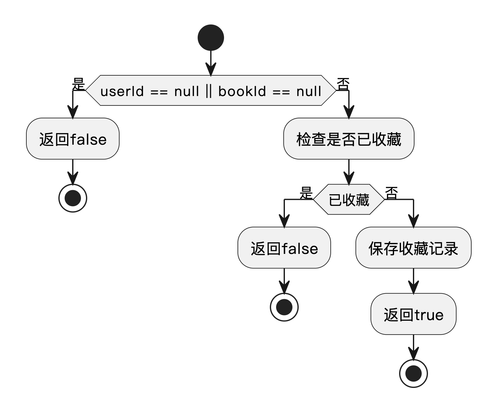

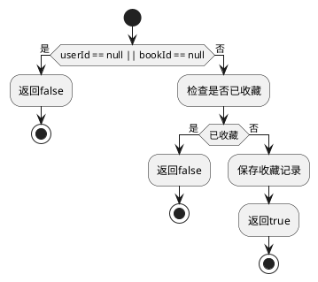

##### 1.1.3 语句覆盖测试

语句覆盖确保代码中的每条语句至少被执行一次。

| 测试用例ID | 测试场景 | 测试输入 | 预期结果 | 覆盖语句 |
| --- | --- | --- | --- | --- |
| TCF-SC01 | 无效用户ID | userId=null, bookId=1 | 返回false | 3-5行 |
| TCF-SC02 | 无效图书ID | userId=1, bookId=null | 返回false | 3-5行 |
| TCF-SC03 | 已收藏图书 | userId=1, bookId=1, 已收藏 | 返回false | 3-10行 |
| TCF-SC04 | 正常收藏 | userId=1, bookId=1, 未收藏 | 返回true | 3-9, 12-13行 |

##### 1.1.4 判定覆盖测试

判定覆盖测试确保每个判定的每种可能结果都至少出现一次。

| 测试用例ID | 判定 | 判定结果 | 测试输入 | 预期结果 |
| --- | --- | --- | --- | --- |
| TCF-DC01 | userId == null \|\| bookId == null | true | userId=null, bookId=1 | 返回false |
| TCF-DC02 | userId == null \|\| bookId == null | true | userId=1, bookId=null | 返回false |
| TCF-DC03 | userId == null \|\| bookId == null | false | userId=1, bookId=1 | 继续执行 |
| TCF-DC04 | isAlreadyFavorite(userId, bookId) | true | userId=1, bookId=1, 已收藏 | 返回false |
| TCF-DC05 | isAlreadyFavorite(userId, bookId) | false | userId=1, bookId=1, 未收藏 | 返回true |

##### 1.1.5 条件覆盖测试

条件覆盖关注复合判定中各个简单条件的取值情况。

| 测试用例ID | 条件 | 条件取值 | 测试输入 | 预期结果 |
| --- | --- | --- | --- | --- |
| TCF-CC01 | userId == null | true | userId=null, bookId=1 | 返回false |
| TCF-CC02 | userId == null | false | userId=1, bookId=1 | 继续执行 |
| TCF-CC03 | bookId == null | true | userId=1, bookId=null | 返回false |
| TCF-CC04 | bookId == null | false | userId=1, bookId=1 | 继续执行 |

##### 1.1.6 判定/条件覆盖与条件组合覆盖测试

综合测试判定与条件组合的各种可能性。

| 测试用例ID | 判定与条件组合 | 测试输入 | 预期结果 |
| --- | --- | --- | --- |
| TCF-MCC01 | (userId=null, bookId任意)，第一个条件为真 | userId=null, bookId=1 | 返回false |
| TCF-MCC02 | (userId非null, bookId=null)，第二个条件为真 | userId=1, bookId=null | 返回false |
| TCF-MCC03 | (userId非null, bookId非null)，两个条件都为假 | userId=1, bookId=1 | 继续执行 |

##### 1.1.7 路径覆盖测试

测试程序中所有可能的执行路径。

| 测试用例ID | 主要路径 | 测试输入 | 预期结果 |
| --- | --- | --- | --- |
| TCF-PC01 | 参数验证失败路径 | userId=null 或 bookId=null | 返回false |
| TCF-PC02 | 已收藏路径 | userId=1, bookId=1, 已收藏 | 返回false |
| TCF-PC03 | 正常收藏路径 | userId=1, bookId=1, 未收藏 | 返回true |

#### 1.2 循环结构测试

循环结构测试关注代码中的循环语句，测试不同循环次数和条件下的行为。

##### 1.2.1 测试代码 - getOrderedFavoriteBooks方法

```java
/**
 * 按收藏顺序获取图书列表
 */
public List<Book> getOrderedFavoriteBooks(List<Long> bookIds, List<Book> allBooks) {
    // 参数验证
    if (bookIds == null || allBooks == null) {
        return new ArrayList<>();
    }
    
    // 按ID顺序排列图书
    List<Book> result = new ArrayList<>();
    for (Long id : bookIds) {
        for (Book book : allBooks) {
            if (book.getId().equals(id)) {
                result.add(book);
                break;
            }
        }
    }
    
    return result;
}
```

##### 1.2.2 循环流程图

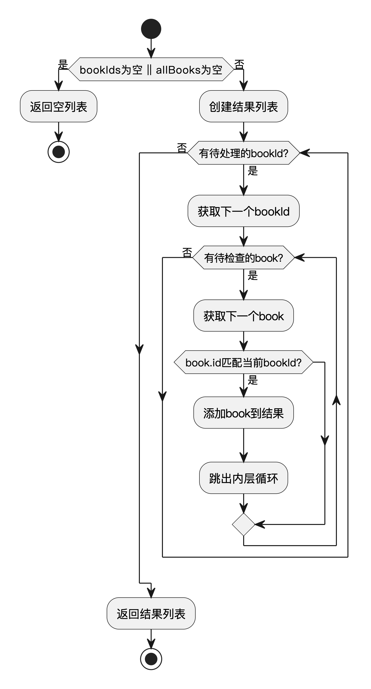

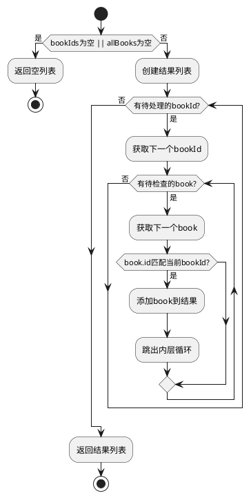

##### 1.2.3 循环结构测试用例

设计测试用例验证不同循环情况下的行为：

| 测试用例ID | 测试场景 | 测试输入 | 预期结果 |
| --- | --- | --- | --- |
| TCF-LT01 | 参数为空 | bookIds=null, allBooks=[...] | 返回空列表 |
| TCF-LT02 | 图书列表为空 | bookIds=[1,2,3], allBooks=null | 返回空列表 |
| TCF-LT03 | 两个列表都为空 | bookIds=[], allBooks=[] | 返回空列表 |
| TCF-LT04 | 单个ID匹配 | bookIds=[1], allBooks=[id=1的图书] | 返回包含一本图书的列表 |
| TCF-LT05 | 完全匹配 | bookIds=[1,2,3], allBooks=[id=1,2,3的图书] | 返回与bookIds顺序一致的图书列表 |
| TCF-LT06 | 部分匹配 | bookIds=[1,2,3], allBooks=[id=1,3的图书] | 返回只包含id=1,3的图书列表 |
| TCF-LT07 | 无匹配 | bookIds=[1,2,3], allBooks=[id=4,5的图书] | 返回空列表 |
| TCF-LT08 | 嵌套循环性能 | 大量ID和图书测试 | 在合理时间内完成处理 |

### 2. 黑盒测试（等价类划分法）

#### 2.1 测试对象描述

"收藏管理"功能允许用户对图书进行收藏和取消收藏操作。用户需输入用户ID和图书ID，系统要求这两个ID均为正整数且必须存在于系统中。对于收藏操作，若该用户已收藏该图书，则不能重复收藏；对于取消收藏操作，若未收藏则不能取消。所有输入参数必须合法，否则系统应提示错误，操作失败。

#### 2.2 等价类划分

| 条件描述                     | 有效等价类（编号Ex）         | 无效等价类（编号Ix）         |
|------------------------------|-----------------------------|-----------------------------|
| 用户ID为已存在的正整数       | E1: 用户ID为有效正整数且存在 | I1: 用户ID为负数/零/不存在   |
| 图书ID为已存在的正整数       | E2: 图书ID为有效正整数且存在 | I2: 图书ID为负数/零/不存在   |
| 收藏前未收藏该图书           | E3: 用户未收藏该图书         | I3: 用户已收藏该图书         |
| 取消前已收藏该图书           | E4: 用户已收藏该图书         | I4: 用户未收藏该图书         |

#### 2.3 测试用例设计

| 测试用例ID | 测试用例名称         | 测试输入                                                         | 预期结果                   | 覆盖等价类         |
| ---------- | -------------------- | ---------------------------------------------------------------- | -------------------------- | ------------------ |
| TC-F01     | 正常收藏             | 用户ID: 1（存在）<br>图书ID: 1（存在）<br>用户未收藏该图书         | 收藏成功                   | E1,E2,E3           |
| TC-F02     | 用户ID无效           | 用户ID: -1<br>图书ID: 1（存在）<br>用户未收藏该图书               | 收藏失败，提示用户ID无效   | I1                 |
| TC-F03     | 图书ID无效           | 用户ID: 1（存在）<br>图书ID: -1<br>用户未收藏该图书               | 收藏失败，提示图书ID无效   | I2                 |
| TC-F04     | 已收藏重复收藏       | 用户ID: 1（存在）<br>图书ID: 1（存在）<br>用户已收藏该图书           | 收藏失败，提示已收藏       | I3                 |
| TC-F05     | 正常取消收藏         | 用户ID: 1（存在）<br>图书ID: 1（存在）<br>用户已收藏该图书           | 取消收藏成功               | E1,E2,E4           |
| TC-F06     | 未收藏取消收藏       | 用户ID: 1（存在）<br>图书ID: 1（存在）<br>用户未收藏该图书           | 取消失败，提示未收藏       | I4                 |

## 四、用户界面与登录注册模块测试(刘思磊)

### 1. 白盒测试

本节对UserServiceImpl类中的用户注册登录相关方法进行白盒测试设计，包括选择结构测试和循环结构测试。

#### 1.1 选择结构测试

选择结构测试针对具有判断和多个分支的代码，测试不同条件下的程序行为。

##### 1.1.1 测试代码 - register方法

```java
/**
 * 用户注册
 */
public boolean register(User user) {
    // 检查用户名是否已存在
    if (checkUsernameExists(user.getUsername())) {
        return false;
    }
    
    // 设置默认值
    if (user.getStatus() == null) {
        user.setStatus(1); // 默认启用
    }
    
    // 保存用户
    return true;
}
```

##### 1.1.2 方法流程图

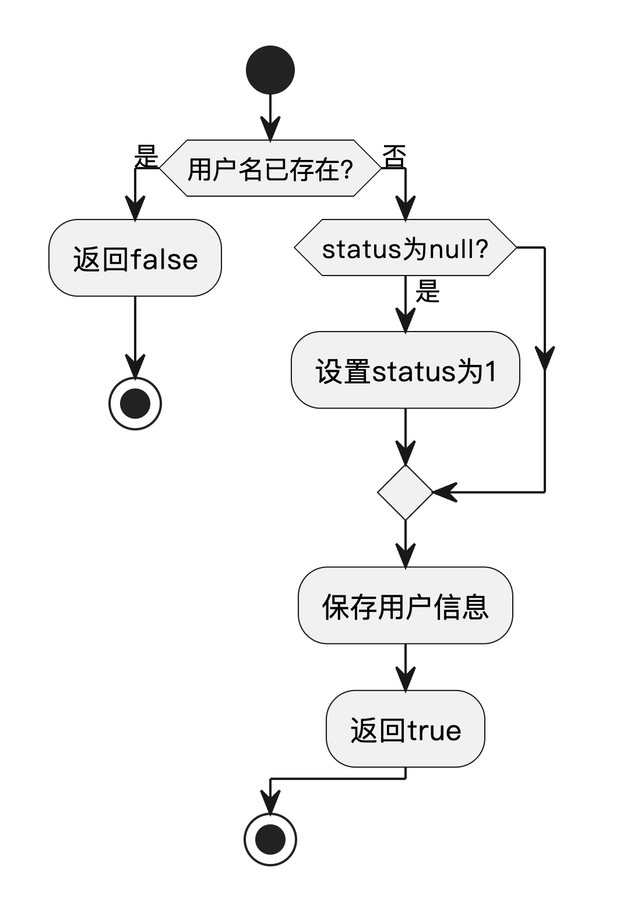

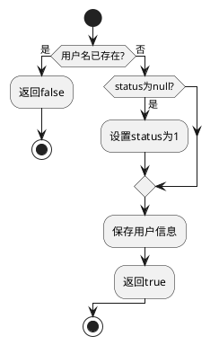

##### 1.1.3 语句覆盖测试

语句覆盖确保程序中的每条语句至少执行一次，是最基本的覆盖标准。

| 测试用例ID | 测试场景 | 测试输入 | 预期结果 | 覆盖语句 |
| --- | --- | --- | --- | --- |
| TCU-SC01 | 用户名已存在 | username="已存在用户名" | 返回false | 3-5行 |
| TCU-SC02 | 状态为null | username="新用户", status=null | 设置status=1并返回true | 3-4, 7-13行 |
| TCU-SC03 | 状态非null | username="新用户", status=2 | 保持status=2并返回true | 3-4, 11-13行 |

##### 1.1.4 判定覆盖测试

判定覆盖测试关注代码中每个判定结构的取值情况，确保每个判定的每个可能结果至少发生一次。

| 测试用例ID | 判定 | 判定结果 | 测试输入 | 预期结果 |
| --- | --- | --- | --- | --- |
| TCU-DC01 | checkUsernameExists(user.getUsername()) | true | username="已存在用户名" | 返回false |
| TCU-DC02 | checkUsernameExists(user.getUsername()) | false | username="新用户" | 继续执行 |
| TCU-DC03 | user.getStatus() == null | true | status=null | 设置status=1 |
| TCU-DC04 | user.getStatus() == null | false | status=2 | 保持status不变 |

##### 1.1.5 条件覆盖测试

条件覆盖关注复合判定中各个简单条件的取值情况。

| 测试用例ID | 条件 | 条件取值 | 测试输入 | 预期结果 |
| --- | --- | --- | --- | --- |
| TCU-CC01 | checkUsernameExists(user.getUsername()) | true | username="已存在用户名" | 返回false |
| TCU-CC02 | checkUsernameExists(user.getUsername()) | false | username="新用户" | 继续执行 |
| TCU-CC03 | user.getStatus() == null | true | status=null | 设置status=1 |
| TCU-CC04 | user.getStatus() == null | false | status=2 | 保持status不变 |

##### 1.1.6 判定/条件覆盖测试

这部分测试综合了判定覆盖和条件覆盖，确保各种组合都被测试到。

| 测试用例ID | 判定与条件组合 | 测试输入 | 预期结果 |
| --- | --- | --- | --- |
| TCU-MCC01 | checkUsernameExists()=true | username="已存在用户名" | 返回false |
| TCU-MCC02 | checkUsernameExists()=false, status=null | username="新用户", status=null | 设置status=1, 返回true |
| TCU-MCC03 | checkUsernameExists()=false, status非null | username="新用户", status=2 | 保持status不变, 返回true |

##### 1.1.7 路径覆盖测试

路径测试关注程序中的执行路径，确保主要的执行分支都能被测试到。

| 测试用例ID | 主要路径 | 测试输入 | 预期结果 |
| --- | --- | --- | --- |
| TCU-PC01 | 用户名已存在路径 | username="已存在用户名" | 返回false |
| TCU-PC02 | 新用户，status为null路径 | username="新用户", status=null | 设置status=1, 返回true |
| TCU-PC03 | 新用户，status已设置路径 | username="新用户", status=2 | 保持status不变, 返回true |

#### 1.2 循环结构测试

循环结构测试关注程序中的循环语句，测试不同循环次数和循环体内执行路径的情况。

##### 1.2.1 测试代码 - validateUserBatch方法

```java
/**
 * 批量验证用户
 */
public Map<String, Boolean> validateUserBatch(List<User> users) {
    Map<String, Boolean> results = new HashMap<>();
    
    if (users == null || users.isEmpty()) {
        return results;
    }
    
    for (User user : users) {
        if (user == null || user.getUsername() == null) {
            results.put("unknown", false);
            continue;
        }
        
        String username = user.getUsername();
        boolean isValid = !checkUsernameExists(username);
        results.put(username, isValid);
    }
    
    return results;
}
```

##### 1.2.2 循环流程图

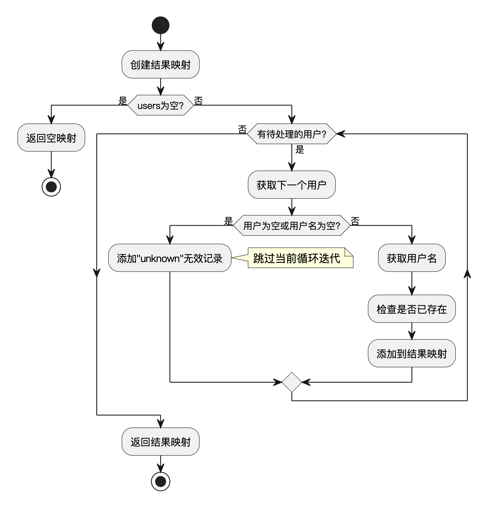

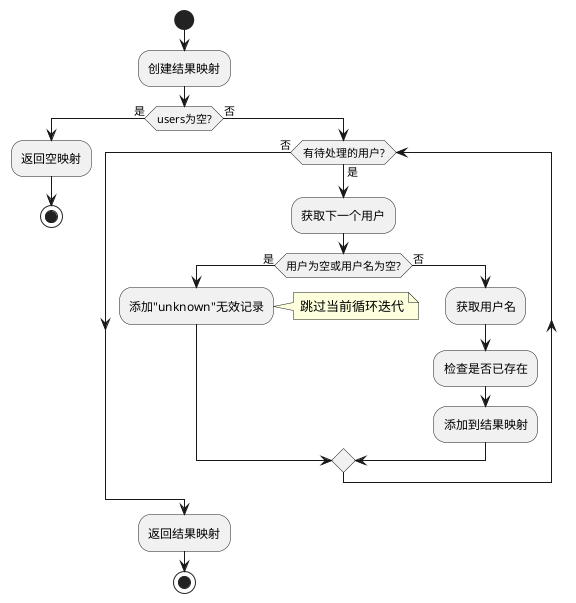

##### 1.2.3 循环结构测试用例

针对循环结构设计的测试用例，测试不同循环条件和分支。

| 测试用例ID | 测试场景 | 测试输入 | 预期结果 |
| --- | --- | --- | --- |
| TCU-LT01 | 空列表测试 | users=null | 返回空映射 |
| TCU-LT02 | 空列表测试 | users=[] | 返回空映射 |
| TCU-LT03 | 单元素测试-正常用户 | users=[{username="test"}] | 返回包含一个用户验证结果的映射 |
| TCU-LT04 | 单元素测试-无效用户 | users=[{username=null}] | 返回包含"unknown:false"的映射 |
| TCU-LT05 | 多元素测试-全部有效 | users=[{多个有效用户}] | 返回所有用户验证结果的映射 |
| TCU-LT06 | 多元素测试-部分有效 | users=[{部分有效用户,部分无效用户}] | 返回混合验证结果的映射 |
| TCU-LT07 | 多元素测试-全部无效 | users=[{全部无效用户}] | 返回全部为false的映射 |
| TCU-LT08 | 边界测试 | 包含大量用户的列表 | 正常处理不抛异常 |

### 2. 黑盒测试（等价类划分法）

#### 2.1 测试对象描述

"用户注册与登录"功能要求用户输入用户名和密码进行注册和登录。用户名为必填项，长度要求在5到20个字符之间，且必须唯一。密码为必填项，长度要求在6到20个字符之间。注册时，若用户名已存在或输入不符合要求，系统应提示错误并注册失败。登录时，若用户名不存在或密码错误，系统应提示登录失败。

#### 2.2 等价类划分

| 条件描述                 | 有效等价类（编号Ex）         | 无效等价类（编号Ix）         |
|--------------------------|-----------------------------|-----------------------------|
| 用户名长度为5-20字符且唯一 | E1: 用户名5-20字符且唯一     | I1: 用户名少于5字符<br>I2: 用户名多于20字符<br>I3: 用户名已存在 |
| 密码长度为6-20字符        | E2: 密码6-20字符            | I4: 密码少于6字符<br>I5: 密码多于20字符 |
| 登录时用户名存在          | E3: 用户名存在               | I6: 用户名不存在             |
| 登录时密码正确            | E4: 密码正确                 | I7: 密码错误                 |

#### 2.3 测试用例设计

| 测试用例ID | 测试用例名称         | 测试输入                                                         | 预期结果                   | 覆盖等价类         |
| ---------- | -------------------- | ---------------------------------------------------------------- | -------------------------- | ------------------ |
| TC-U01     | 注册成功             | 用户名: "user01"<br>密码: "passwd123"                         | 注册成功                   | E1,E2              |
| TC-U02     | 用户名过短           | 用户名: "usr"<br>密码: "passwd123"                             | 注册失败，提示用户名过短   | I1                 |
| TC-U03     | 用户名过长           | 用户名: 21字符<br>密码: "passwd123"                             | 注册失败，提示用户名过长   | I2                 |
| TC-U04     | 用户名已存在         | 用户名: "user01"（已注册）<br>密码: "passwd123"                | 注册失败，提示用户名已存在 | I3                 |
| TC-U05     | 密码过短             | 用户名: "user02"<br>密码: "123"                                | 注册失败，提示密码过短     | I4                 |
| TC-U06     | 密码过长             | 用户名: "user03"<br>密码: 21字符                                | 注册失败，提示密码过长     | I5                 |
| TC-U07     | 登录成功             | 用户名: "user01"<br>密码: "passwd123"                         | 登录成功                   | E3,E4              |
| TC-U08     | 登录用户名不存在     | 用户名: "nouser"<br>密码: "passwd123"                          | 登录失败，提示用户名不存在 | I6                 |
| TC-U09     | 登录密码错误         | 用户名: "user01"<br>密码: "wrongpass"                          | 登录失败，提示密码错误     | I7                 |
